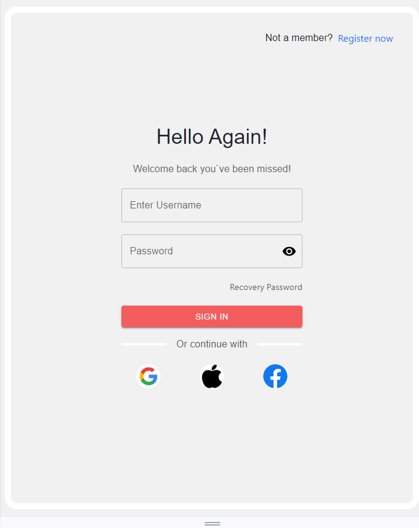

# Login Page

A simple login page created with React.



## Table of Contents

- [Description](#description)
- [Features](#features)
- [Installation](#installation)
- [Usage](#usage)
- [Contributing](#contributing)
- [License](#license)

## Description

This project is a basic login page designed using React to demonstrate a simple user authentication interface. It includes fields for the user to input their username and password, and it features basic styling to make the form visually appealing.

## Features

- Responsive design
- Simple and clean UI
- Basic form validation

## Installation

To get a local copy up and running, follow these steps:

1. **Clone the repository:**

    ```bash
    git clone https://github.com/Mahdirahimiam/login-page.git
    ```

2. **Navigate to the project directory:**

    ```bash
    cd login-page
    ```

3. **Install dependencies:**

    ```bash
    npm install
    ```

4. **Start the development server:**

    ```bash
    npm start
    ```

    The application will automatically open in your default web browser. If it doesn't, you can manually navigate to `http://localhost:3000` in your browser.

## Usage

To use the login page, simply enter your username and password in the provided fields and click the "Login" button. If you want to integrate this page into a backend system for actual authentication, you will need to modify the JavaScript to handle form submissions to your server.

## Contributing

Contributions are what make the open-source community such an amazing place to learn, inspire, and create. Any contributions you make are **greatly appreciated**.

1. Fork the Project
2. Create your Feature Branch (`git checkout -b feature/AmazingFeature`)
3. Commit your Changes (`git commit -m 'Add some AmazingFeature'`)
4. Push to the Branch (`git push origin feature/AmazingFeature`)
5. Open a Pull Request

## License

Distributed under the MIT License. See `LICENSE` for more information.

